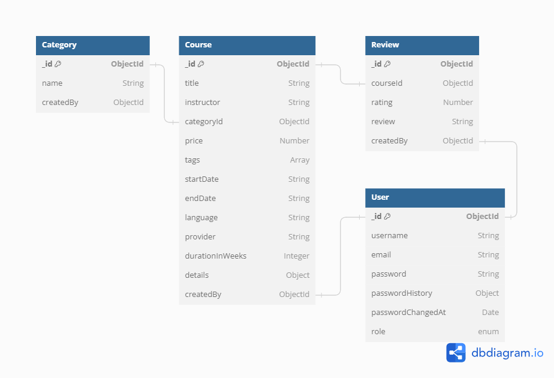

# Assignment-4: Enhanced User Authentication and Authorization System

### API Live Link: https://course-review-with-auth-one.vercel.app/

### Postman API Documentation: https://documenter.getpostman.com/view/15226030/2s9YkuZe5y

### Technology Stack:

- **Programming Language:** TypeScript
- **Web Framework:** Express.js
- **Object Data Modeling (ODM) and Validation Library(zod):** Mongoose for MongoDB

## Running the Application Locally

1. Clone the Repository:

```bash
  git clone https://github.com/Porgramming-Hero-web-course/l2b2a4-course-review-with-auth-Sabbir2809
```

2. Navigate to the project directory:

```bash
  cd course-review-with-auth
```

3. Install Dependencies:

```bash
npm install
```

4. Setup environment variables:

```.env
NODE_DEV=development
PORT=your_port_number
DATABASE_URL=your_mongodb_url
BCRYPT_SALT_ROUNDS=your_bcrypt_salt_rounds
JWT_ACCESS_SECRET=your_jwt_access_secret
JWT_ACCESS_EXPIRES_IN=your_jwt_access_expires_in
```

5. Run the application command:

```bash
npm run start
or
npm run dev
```

## Entity Relationship Diagram (Data Model for Mongoose)


